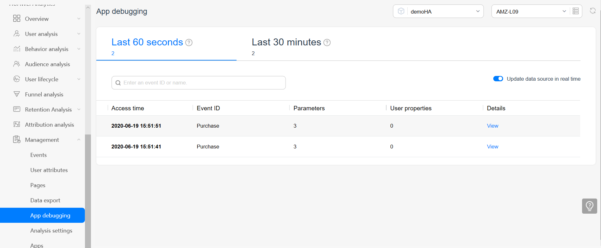

# HmsDtmSample

English | [中文](https://github.com/HMS-Core/hms-dtm-demo-android-studio/blob/master/README_ZH.md)

## Table of Contents

 * [Introduction](#Introduction)
 * [Getting Started](#Getting-started)
 * [Supported Environments](#supported-environments)
 * [Result](#Result)
 * [License](#license)

## Introduction
With Dynamic Tag Manager, you can dynamically update tracking tags on a web-based UI to track specific events and report data to third-party analytics platforms, tracking your marketing activity data as needed.

This demo shows you how to track purchase events and report data, helping you integrate Dynamic Tag Manager quickly. 

For details, visit https://developer.huawei.com/consumer/en/doc/development/HMSCore-Guides/introduction-0000001050043907.

## Getting Started
1. Register as a developer.

Register a [HUAWEI account](https://developer.huawei.com/consumer/en/).
2. Create an app.

Create an app and enable APIs.
3. Build the demo.

To build this demo, please first import the demo to Android Studio (3.X or later). Then download the agconnect-services.json file of the app from AppGallery Connect, and add the file to the app directory (\app) of the demo. 

## Supported Environments
Android Studio 3.0 or later and JDK 1.7 or later

## Result
   

## License
The sample code has obtained the [Apache License, version 2.0](http://www.apache.org/licenses/LICENSE-2.0).
