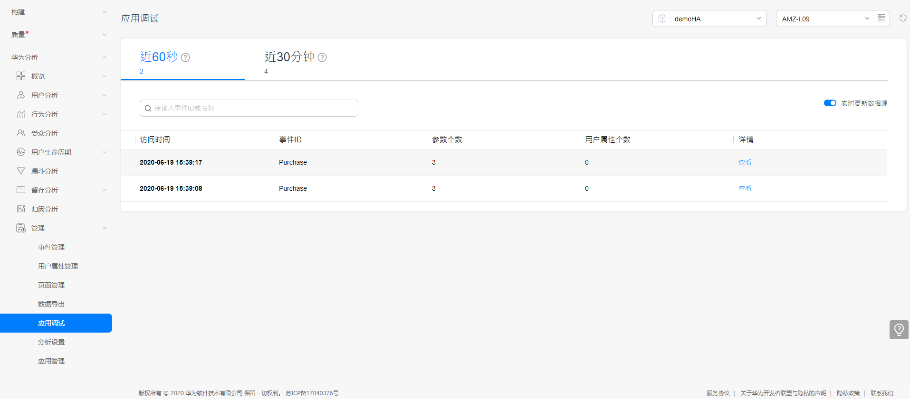

# HMS Dynamic Tag Manager(DTM) Sample for Android

 

中文 | [English](https://git.huawei.com/HMS_Core_SPDT/WiseAnalytics/DTM/DTMSDK_Android_CodeLab/blob/master/README.md)

## 目录

 * [介绍](#介绍)
 * [运行步骤 ](#运行步骤 )
 * [支持的环境](#支持的环境)
 * [运行结果](#运行结果)
 * [许可证](#许可证)

## 介绍
Dynamic Tag Manager 通过 Web 页面动态更新跟踪代码，轻松完成特定事件跟踪并将数据传送给第三方分析平台，实现营销数据随需监控。

本 Demo 演示如何快速跟踪购买事件并实现数据上报，帮助您尽快集成 Dynamic Tag Manager。

详细文档参见 [开发指南](https://developer.huawei.com/consumer/cn/doc/development/HMSCore-Guides/introduction-0000001050043907)。

## 运行步骤
在开发应用前，需要在 AppGallery Connect 中配置相关信息。

1. 注册成为华为开发者。

具体方法请参见 [账号注册认定](https://developer.huawei.com/consumer/cn/doc/start/registration-and-verification-0000001053628148)。

2. 创建应用。

具体方法请参见 [创建您的AGC项目](https://developer.huawei.com/consumer/cn/doc/development/AppGallery-connect-Guides/agc-get-started#h1-1587476272328) 以及 [在项目下添加应用](https://developer.huawei.com/consumer/cn/doc/development/AppGallery-connect-Guides/agc-get-started#h1-1587476998161)。
3. 构建示例程序。

要构建此示例，请首先将该示例导入 Android Studio（3.X 或更高版本）。然后从 AppGallery Connect 下载该应用程序的 agconnect-services.json 文件，并将该文件添加到演示的应用程序目录（\app）中。

## 支持的环境
推荐使用 Android Studio 3.0 及 JDK 1.7 以上的版本。

## 运行结果
   

## 技术支持
如果您对 HMS Core 还处于评估阶段，可在 [Reddit 社区](https://www.reddit.com/r/HuaweiDevelopers/) 获取关于 HMS Core 的最新讯息，并与其他开发者交流见解。

如果您对使用 HMS 示例代码有疑问，请尝试：
- 开发过程遇到问题上 [Stack Overflow](https://stackoverflow.com/questions/tagged/huawei-mobile-services)，在 `huawei-mobile-services` 标签下提问，有华为研发专家在线一对一解决您的问题。
- 到 [华为开发者论坛](https://developer.huawei.com/consumer/cn/forum/blockdisplay?fid=18) HMS Core 板块与其他开发者进行交流。

## 许可证
此示例代码已获得 [Apache License, version 2.0](http://www.apache.org/licenses/LICENSE-2.0).
